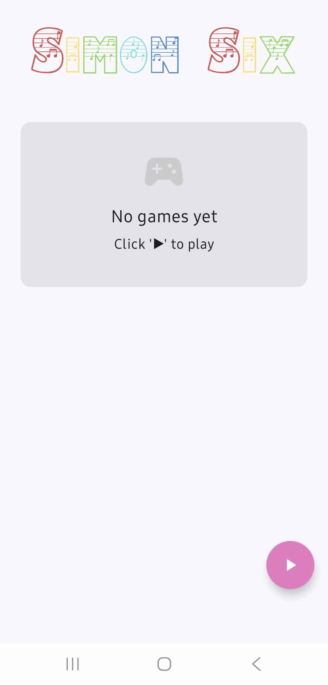
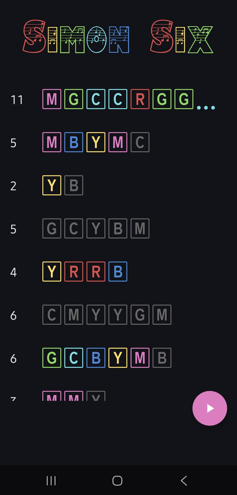
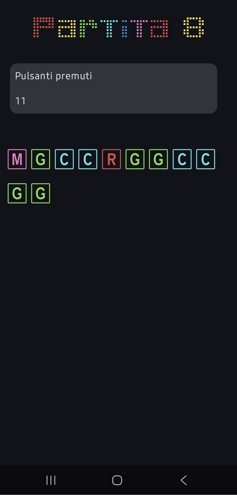
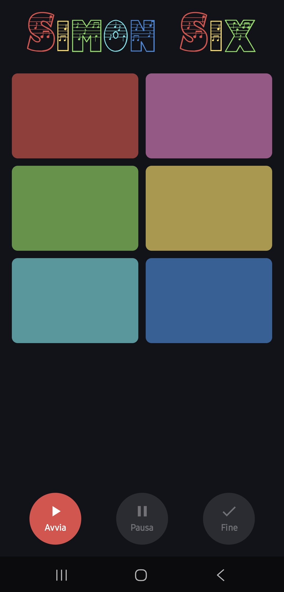
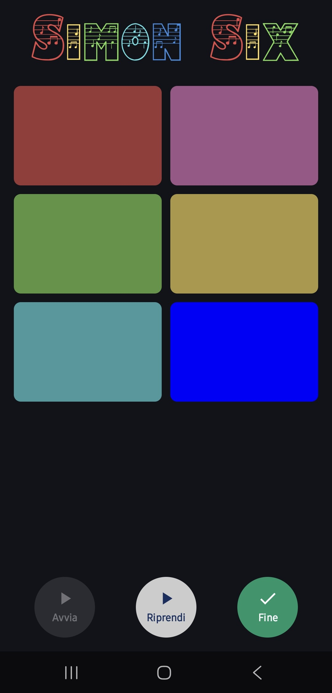
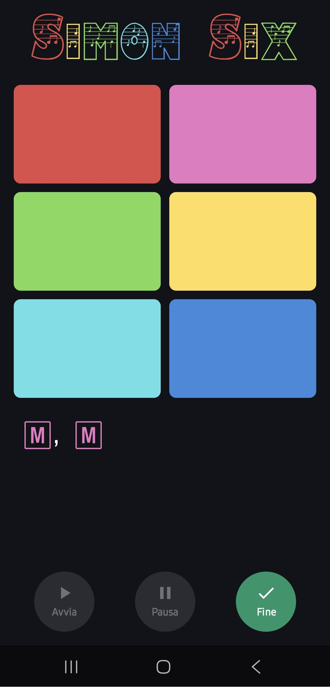
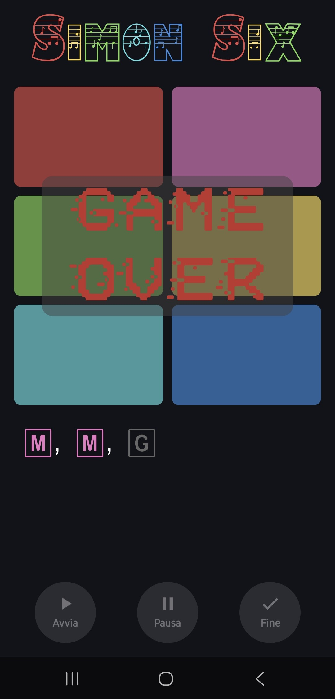

# Simon Six

Simon Six è una versione del classico gioco di memoria **Simon** con **6 colori** invece di 4.  
Sviluppato in Kotlin con **Jetpack Compose**.

---

## Descrizione
Simon Six è un'applicazione con tre schermate: Chronology, DetailGame e Game.
Il gioco mostra una sequenza di colori sempre più lunga che il giocatore deve ripetere.
Ad ogni round corretto si aggiunge un colore.
Supporta sia l'orientamento **verticale** che **orizzontale** con un'interfaccia adattiva. Inoltre
supporta anche la modalità **giorno** e **notte**.

### Chronology Screen
La schermata è composta da una lista delle partite precedenti: ogni elemento della lista è cliccabile
e mostra quanti pulsanti sono stati premuti e la sequenza.
Le partite sono mostrate in **ordine cronologico**.

Se la sequenza non può essere scritta interamente nello schermo viene troncata con **...**.

Per avviare una nuova partita è necessario premere il pulsante magenta nell'angolo in basso a destra.

### Detail Screen
Se viene cliccata una partita viene mostrata la Detail Screen. In questa schermata viene indicato il
numero di partita, quanti pulsanti sono stati premuti e la sequenza.

### Game Screen
Composta da una **griglia 2x3** di pulsanti colorati che una volta premuti aggiungono alla sequenza il simbolo secondo la tabella a seguire. Il testo viene visualizzato in base al colore premuto.

| Simbolo | Colore  | Hex       |
|---------|---------|-----------|
| `R`     | Rosso   | `#E24B4A` |
| `Y`     | Giallo  | `#FFDE59` |
| `G`     | Verde   | `#7ED957` |
| `C`     | Ciano   | `#5CE1E6` |
| `B`     | Blu     | `#378ADD` |
| `M`     | Magenta | `#E978C4` |

Nella parte inferiore dello schermo sono presenti tre pulsanti: il primo server per avviare la partita,
il secondo per fermare la sequenza mostrata e riprenderla più avanti e il terzo per finire la partita.

In caso di sequenza errata finisce la partita e per tornare alla homepage è necessario premere il back di sistema.

---
## Screenshots

<table>
  <tr>
    <td></td>
    <td></td>
    <td></td>
  </tr>
  <tr>
    <td></td>
    <td></td>
    <td></td>
    <td></td>
  </tr>
</table>

---

## Dispositivi testati

### Smartphone

|    Marca    |      Modello      |   Versione   |
|-------------|-------------------|--------------|
| Samsung     | Galaxy A55 5G     | 16           |
| Redmi       | 12                | 15           |
| Redmi       | Note 11 Pro+ 5G   | 13           |

### Tablet

|    Marca    |      Modello      |   Versione   |
|-------------|-------------------|--------------|
| Samsung     | Tab S6 Lite       | 14           |

---

## Credits

### Font
Tutti i font sono stati scaricati da [DaFont](https://www.dafont.com) e sono utilizzati per uso personale.

- **Amadeus** by Bright Ideas — [dafont.com](https://www.dafont.com/amadeus-regular.font) — Free for personal use
- **Game Power** by Dinael Urdaneta — [dafont.com](https://www.dafont.com/game-power.font) — Free for personal use
- **KazyCase** by Emmanuel Didier (KAZY) — [dafont.com](https://www.dafont.com/kazycase.font) — Free for personal use
- **Positive System** by Woodcutter — [dafont.com](https://www.dafont.com/positive-system.font) — Free for personal use

### Suoni
I suoni sono stati scaricati da [Pixabay](https://pixabay.com) e sono utilizzati sotto [Pixabay Content License](https://pixabay.com/service/license-summary/).

